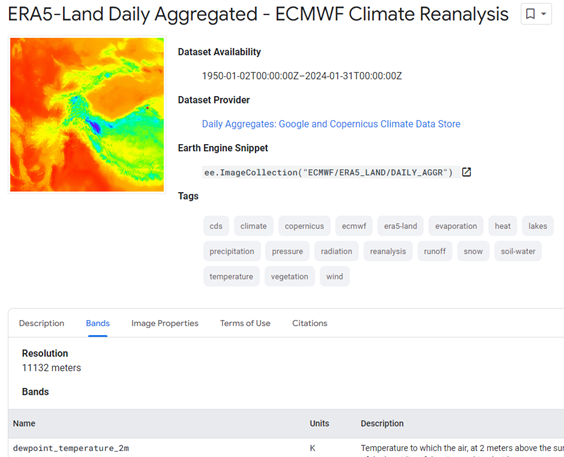
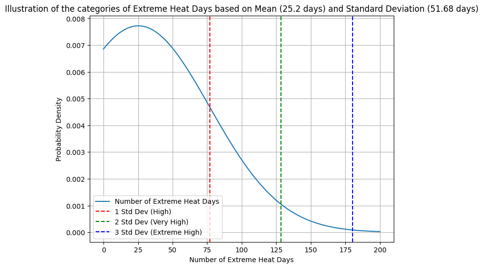
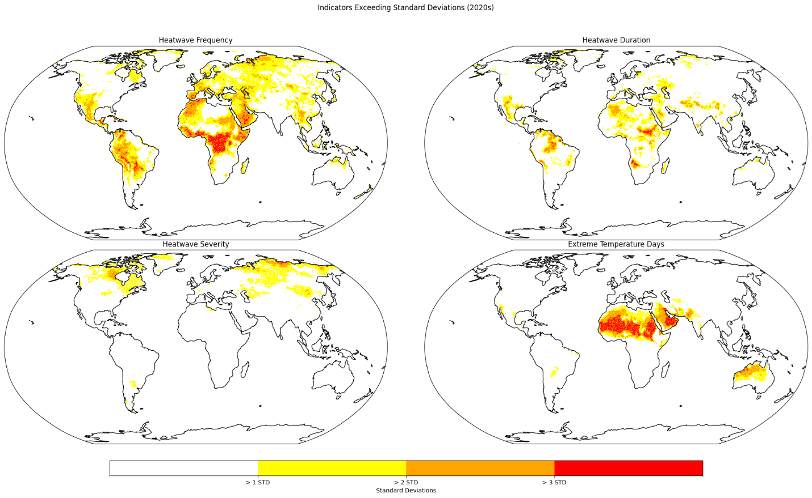
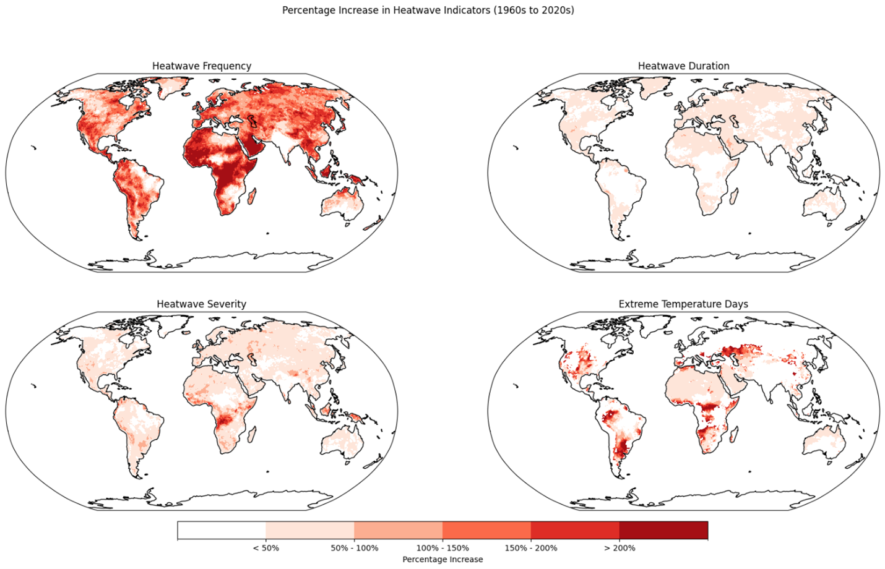

# Heatwave Indicators and child population exposure between 1960 and 2024

## Purpose

This project aims at producing heatwave indicators globally and measure the exposure of child population on extreme heatwaves indicator values and significant changes in them over time.

## Heatwave indicators definitions

**Heatwave**: Any period of three days or more when the maximum temperature each day is in the top 10 per cent of the local 15-day average between 1960 and 1990.

**Heatwave duration**: Average length of heatwave event (Number of days).

**Heatwave severity**: Average exceedance in degrees Celsius of the heatwave threshold for each event.

**Extreme high temperature**: Annual average number of days in which 35°C is exceeded.

## Data

### Temperature data

ERA5-Land Daily Aggregated data from 1960 to 2024.

Spatial resolution: 11132 meters

Temporal resolution: Daily aggregated

### Population data

Global Human Settlement Population data (GHS-POP - R2023A; Schiavina, 2023; accessed July 10, 2024) were downloaded from the Copernicus ftp site (<https://human-settlement.emergency.copernicus.eu/download.php?ds=pop>). These data were then adjusted to estimate the child population percentage using population by Select Age Groups - Both Sexes layer from the 2024 Revision of World Population Prospects data (United Nations, 2024; accessed July 10, 2024).

Resolution: 1 km

Time period: 1975 to 2025 every 5

## Methods

- Baseline daily mean data
  - Input : 1960 to 1990 daily temperature_2m_max
  - Output : mean maximum temperature for 365 Day Of Years
- 15 day rolling average from 30 year mean
  - Input : mean maximum temperature for 365 days
  - Output : 15 days rolling average for 365 days
- 90 Percentile values
  - Input :15 days rolling average for 365 days
  - Output : 90 percentile values of the local 15-day average
- Extreme Heat identification
  - Input : daily temperature values over 35 degree Celsius TH.
  - Output : days where local extreme heat were identified
- Heatwaves indicators
  - Input: 90 percentile values, daily temperature values
  - Output: numbers of heatwave incidents where 3 or more consecutive extreme heat days are identified, heatwave durations for heatwave incidents, heatwave severity
  - Resampling: the heatwaves indicators are produced at original resolution of temperature data with is about 11km. However, they are resampled to the resolution of the population data to match between two datasets.
- Extreme values and change analysis.

Extreme cases are defined using global mean and standard deviation.

**Historic mean values (between 1960-1990)**

Heatwave Frequency : 6.16 (times)

Heatwave Duration : 4.68 (days)

Heatwave Severity : 1.9 (°C)

Extreme Temperature Days : 25.2 (days)

**Standard deviation**

Heatwave Frequency : 2.91

Heatwave Duration : 0.85

Heatwave Severity : 0.88

Extreme Temperature Days : 51.68

- - High values, very high values and Extreme high values are defined as below

High : > Mean + 1STD (about upper 16%)

Very High : > Mean + 2 STD (upper 2.5%)

Extreme High : > Mean + 3 STD (upper 0.15%)

- Child population exposure calculation
  - Input: child population data from 1975 to 2025 by 5 years. Heatwaves indicators averages for decades from the 1960s to 2020s.
  - Output:

1\. numbers of children exposed to extreme cases which deviates significantly from the global historic mean values from 1960 to 1990.

2\. Numbers of children exposed to significant changes of indicator values

## Codes

Python codes to process and calculate the heatwaves indicators are in ‘code’ folder.

heatwaves_indicators_calc_multi_year_product_v1_back.ipynb

hwi_analysis_build_vrt_1960_2024.ipynb

copy_data_from_service_account.ipynb

hwi_analysis_1960_2024.ipynb

child_population_high_res.ipynb

see read.me file under ‘code’ folder for more details.

## Results

### Heatwave indicators

Grid data for four indicators, averaged by decade from the 1960s to the 2020s, are available in the output/hwi_grid_output directory. Each TIFF file represents a decade and contains four bands: Band 1 for heatwave frequencies, Band 2 for heatwave duration, Band 3 for heatwave severity, and Band 4 for extreme heat days over 35 degrees Celsius.

### Tabular data

The tabular data file ‘Children exposure to extreme heat.xlsx’ under the output/statistics directory provides overall statistics of heatwave indicators for each decade. It includes the child population exposed to extreme heatwaves and significant changes in child population exposure between the 1960s and the 2020s. For more details, refer to the first tab of the data file.

### Extreme values

Extreme values exceeding the mean by 1, 2, and 3 standard deviations are calculated, and locations with these extreme values are mapped for each decade from the 1960s to the 2020s, as shown in the figure. Child exposure for each extreme value category is calculated by overlaying child population grid data on the extreme values.

### Significant changes

Areas with significant changes are mapped by identifying regions with more than 50%, 100%, and 200% increases in heatwave indicator values from the 1960s to the 2020s.

